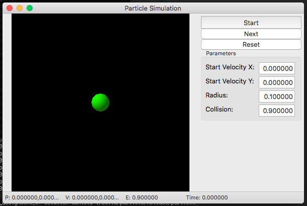

# Assignment 07: Particle simulator

## Summary

In this assigment students must complete the "Particle Simulation" app. This
is an application that simulates how a 2-dimensional particle moves within the 
simulation box and displays it using the graphical user interface.

Students must complete the code to make the application functional. A reference
complete application is provided in Canvas for Windows and Mac operating 
systems. Students should use those to compare to their own implementation.

Additional instructions and example code will be discussed in lecture and/or
notes uploaded to Canvas.

The completed application looks like this:

Windows 10

Mac OSX

## Grading

Autograding verifies only that the submitted code compiles correctly for this
assignment. Grading will be done by manual code inspection and testing.

A file named `NOTES.txt` is included in this repository. Students may use
this file to write any comment about the assignment and its solution.

## General Instructions
 1. Download the starter code using `git clone <your repository url>`.
 2. Open a command line shell and execute `./build.sh` or `build.bat` to 
 generate the project files using `CMake` and to compile the provided code.
 3. Open any file you want edit with a text editor or C++ development 
 environment (e.g. Visual Studio, Xcode) and add your code to them.
 4. Compile your code again with `./build.sh` or `build.bat`, or using the 
 development environment.
 5. Execute the programs and verify they work as expected based on the 
 specific instructions for each problem.
 6. Repeat steps 3-5 as many times as desired.
 7. Once you are satisfied with the result, save your changes using a 
 `git commit` command. For example `git commit -a -m "Complete assignment"`.
 8. Upload your assignment using `git push`.

 You can use `git commit` and/or `git push` as many times as desired. For 
 instance, to save work in progress.
