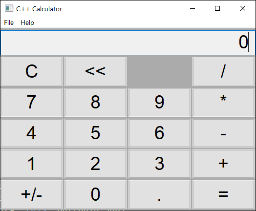
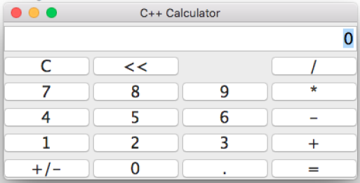
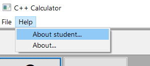
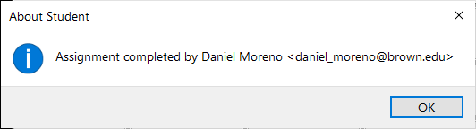

# Assignment 06: Calculator

## Summary

In this assignment students must implement a simple calculator application.The 
calculator have only the four basic math operations: `+`, `-`, `*`, and `/`.

Students must pay attention to the user interface and usability of the 
calculator. This is a change from from previous assignments where the focus 
was on algorithm implementation, data structures, and memory management. It 
should be obvious that for implementing these simple math operations no 
special algorithm nor data structure is required, however, correctly modeling 
the desired behaviour can prove more challenging than what we might initially 
imagine.

## Topics

In this assignment we will:
- Create a graphical user interface application
- Add widgets to the application interface to create the desired calculator look
- Work with elements of the external wxWidgets library
- Handle GUI events 
- Focus on user interaction and application usability

## Grading

Autograding verifies only that the submitted code compiles correctly for this
assignment. Grading will be done by manual code inspection and testing. Special
attention will be put on if students successfully achieve the behaviour outlined
in the section below.

A file named `NOTES.txt` is included in this repository. Students may use
this file to write any comment about the assignment and its solution.

## General Instructions
 1. Download the starter code using `git clone <your repository url>`.
 2. Open a command line shell and execute `./build.sh` or `build.bat` to 
 generate the project files using `CMake` and to compile the provided code.
 3. Open any file you want edit with a text editor or C++ development 
 environment (e.g. Visual Studio, Xcode) and add your code to them.
 4. Compile your code again with `./build.sh` or `build.bat`, or using the 
 development environment.
 5. Execute the programs and verify they work as expected based on the 
 specific instructions for each problem.
 6. Repeat steps 3-5 as many times as desired.
 7. Once you are satisfied with the result, save your changes using a 
 `git commit` command. For example `git commit -a -m "Complete assignment"`.
 8. Upload your assignment using `git push`.

 You can use `git commit` and/or `git push` as many times as desired. For 
 instance, to save work in progress.

## Calculator

The completed calculator must look like this:

Calculator on Windows 10

Calculator on Mac OSX

## Calculator display

The display of the calculator is implemented with a [wxTextCtrl](https://docs.wxwidgets.org/trunk/classwx_text_ctrl.html)
widget. The widget is a member variable in the `MainWindow` class called 
`display_`.

You can use the following functions to manipulate the display contents:

* __ChangeValue__: replaces the current text with a new one

        display_->ChangeValue("new text");

* __SetValue__: identical to `ChangeValue` but triggers an `EVT_TEXT` event 
  after changing the text.

* __AppendText__: appends text to the end of the text control:

        display_->AppendText("1");

* __WriteText__: inserts text at the current "insertion point" (current cursor
  position).

* __GetInsertionPoint__: gets the current insertion point.

* __SetInsertionPoint__: sets the current insertion point.

* __Clear__: clear the contents (i.e. replaces current text by empty string).

Strings are represented with a class called [wxString](https://docs.wxwidgets.org/trunk/classwx_string.html)
within wxWidgets. Conversions to and from this class to other string 
representations is mostly transparent. For instance, the signature for 
[AppendText](https://docs.wxwidgets.org/trunk/classwx_text_entry.html#af80b5a51906ca9c65fa6cdaa9640768b) 
is:

         virtual void wxTextEntry::AppendText(const wxString & text);
         
but code like the following works as expected:

         display_->AppendText("abc");

As written in wxString documentation the use `std::string` must be usually
preferred:

         Note
         While the use of wxString is unavoidable in wxWidgets programs, 
         you are encouraged to use the standard string classes std::string 
         or std::wstring in your applications and convert them to and from 
         wxString only when interacting with wxWidgets.

When conversion to `std:string` must be made explicit, we can use the function
`ToStdString`:

         std::string text{ display_->GetValue().ToStdString() };

## Tasks to complete

Students must complete the following tasks.

### About student menu (20pts)

Add an item to the "Help" menu to show a dialog with your name. The menu must
look like this:

The mene, when clicked, must open a dialog like this but showing the student's
information instead of mine:

### Buttons (20pts)

Add the missing buttons widgets to make the calculator interface look like as
in the screenshots shown in the previous section.

### Event handlers (10pts)

Add event handlers for all the buttons as in the examples:

1. Add member functions to `MainWindow.hpp`

       void onButton7Click(wxCommandEvent& event);
       void onButton8Click(wxCommandEvent& event);
       void onButton9Click(wxCommandEvent& event);

2. Add those function definitions to `MainWindow.cpp`

       void MainWindow::onButton7Click(wxCommandEvent& event)
       {

       }

       void MainWindow::onButton8Click(wxCommandEvent& event)
       {
       
       }

       void MainWindow::onButton9Click(wxCommandEvent& event)
       {

       }

3. Register the event handlers with the buttons

       Bind(wxEVT_BUTTON, &MainWindow::onButton7Click, this, buttonId_7);
       Bind(wxEVT_BUTTON, &MainWindow::onButton8Click, this, buttonId_8);
       Bind(wxEVT_BUTTON, &MainWindow::onButton9Click, this, buttonId_9);

### Display numbers (5pts)

Add code for appending a digit to the display text each time a number button is 
pressed. In addition, add code handling the decimal point button. The latter
must append the decimal point to the current displayed number only if no decimal
point already exists (only one decimal point must be displayed at most).

### Clear and backspace buttons (5pts)

Add code to make the `C` button clear the display and reset the calculator
state. Add code to make the `<<` button delete the last character in the 
display.

### Sign change button (5pts)

Add code to make the sign change button `+/-` functional. This button makes the
current number negative is positive, or positive if negative.

### Calculator functionality (35pts)

Add code to make the calculator functional. Pay particular attention to the
following desired features:

1. The display must always show a valid number without unnecessary heading
zeros.
    * Correct examples: "0", "0.9", "-1", "100.005"
    * Incorrect examples: "", "00.9", "1.9.03", ".5"

2. An empty display must always show "0".
    * For instance after pressing `C`, or after deleting all characters 
    with `<<`.

3. Pressing any of the `+`, `-`, `*`, and `/` keys applies the operation to
the number currently being displayed and last result, and shows result.
    * For example: 
        * Display: `0`
        * Enter a number: 12.5, Display: `12.5`
        * Press `+`, Display: `12.5`
        * Enter a new number: 3, Display: `3`
        * Press `-`, Display: `15.5`
        * Enter a number 1.5: Display: `1.5`
        * Press `=`, Display: `14`

4. Pressing `C` at any time resets display to `0` and forgets any previous 
result or operation in progress.

5. Pressing `<<` deletes the last character in the display only if this is done
while manually entering a number. It does nothing when the displayed number
is a result.
    * For example: 
        * Display: `0`
        * Enter a number: 12.5, Display: `12.5`
        * Press `<<`, Display: `12.`
        * Press `/`, Display: `12`
        * Press `<<`, Display: `12`
        * Press `<<`, Display: `12`
        * Enter a new number: 3, Display: `3`
        * Press `=`, Display: `4`

6. When multiple operation keys are pressed, only the first one is applied 
together with the last result, and only last one is applied with next entered 
number.
    * For example: 
        * Display: `0`
        * Enter a number: 7, Display: `7`
        * Press `*`, Display: `7`
        * Enter a number: 2, Display: `2`
        * Press `+`, Display: `14`
        * Press `+`, Display: `14`
        * Press `/`, Display: `14`
        * Press `-`, Display: `14`
        * Enter a number: 4, Display: `4`
        * Press `=`, Display: `10`

7. Pressing `+/-` changes the sign of a number currently being entered and for
result numbers.
    * For example: 
        * Display: `0`
        * Enter a number: 1, Display: `1`
        * Press `+/-`, Display: `-1`
        * Press `5`, Display: `-15`
        * Press `=`, Display: `-15`
        * Press `<<`, Display: `-15`
        * Press `+/-`, Display: `15`
        * Press `/`, Display: `15`
        * Enter a number: 3, Display: `3`
        * Press `=`, Display: `5`

8. Entering a number after pressing `=` begins a new operation.
    * For example: 
        * Display: `0`
        * Enter a number: 1, Display: `1`
        * Press `+`, Display: `1`
        * Enter a number: 3, Display: `3`
        * Press `=`, Display: `4`
        * Press `2`, Display: `2`
        * Press `*`, Display: `2`
        * Press `3`, Display: `3`
        * Press `=`, Display: `6`

9. Pressing an operation button after `=` considers the last result.
    * For example: 
        * Display: `0`
        * Enter a number: 1, Display: `1`
        * Press `+`, Display: `1`
        * Enter a number: 3, Display: `3`
        * Press `=`, Display: `4`
        * Press `*`, Display: `4`
        * Press `3`, Display: `3`
        * Press `=`, Display: `12` 

## Assignment requirements

Complete the requested implementations by following both the instructions in
this page.

We follow the same conventions as before for naming files and classes. For 
instance, the class `MainWindow` is given in the file `MainWindow.hpp`.

Test your program by manually executing the key sequences from the examples 
above and others of your own.

## References

- [wxWidgets home page](https://www.wxwidgets.org/)
- [wxWidgets documentation](https://docs.wxwidgets.org/stable/)
- [wxWdigets tutorial](https://zetcode.com/gui/wxwidgets/)
- [Hello world repository](https://github.com/ENGN2912B-2022/gui_helloworld)
